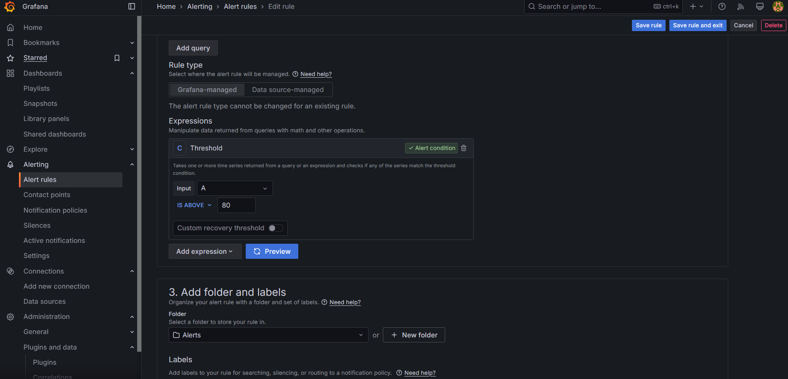

# cortico-test
Take Home Test for DevOps

## Web Server Monitoring

### Architecture


The system will be using cAdvisor to gather real time metrics and Prometheus to scrape the metrics. Grafana's dashboard will be used for visualizing the scraped metrics.

This setup allows for effective scaling by automatically exposing container metrics to cAdvisor every time a new container is going to be added. Grafana can be used also for monitoring and analyzing data from metrics.

### Prerequisites 

#### Installing Docker Engine
Make sure to have Docker installed beforehand. A quick tutorial for installing Docker can be found in the docs [here](https://docs.docker.com/engine/install/).

### Running the System
To run the system simply clone the repo, build the Flask app with docker and run the `docker compose up` command:
```
git clone https://github.com/francis-cuenca/cortico-test.git
cd cortico-test
sudo docker build -t cortico-test-web .
sudo docker compose up
```
Docker should then spin up the containers, which will look like this:


You can check the status of the containers using `sudo docker ps`.
```
CONTAINER ID   IMAGE                             COMMAND                  CREATED             STATUS                   PORTS                                       NAMES
ea683d862ca8   grafana/grafana                   "/run.sh"                42 minutes ago      Up 2 minutes             0.0.0.0:8002->3000/tcp, :::8002->3000/tcp   cortico-test-grafana-1
36eefac6a43b   prom/prometheus                   "/bin/prometheus --c…"   59 minutes ago      Up 2 minutes             0.0.0.0:8001->9090/tcp, :::8001->9090/tcp   cortico-test-prometheus-1
e8a5513e03c5   gcr.io/cadvisor/cadvisor:latest   "/usr/bin/cadvisor -…"   59 minutes ago      Up 2 minutes (healthy)   0.0.0.0:8003->8080/tcp, :::8003->8080/tcp   cadvisor
debf9c0a54f8   cortico-test-web                  "flask run --debug"      About an hour ago   Up 2 minutes             0.0.0.0:8000->5000/tcp, :::8000->5000/tcp   cortico-test-web-1
675900dfab94   redis:alpine                      "docker-entrypoint.s…"   2 hours ago         Up 2 minutes             6379/tcp                                    cortico-test-redis-1
```
### Checking the Grafana dashboard

The Grafana dashboard will be available once the container is up in the address [https://localhost:8002](https://localhost:8002). You will then be able to see the login screen like so:


You can login using these credentials:

username: `admin`

password: `password`

You will then be brought to the home page:


You can then copy the code on `/grafana/grafana-dashboard.json` and import the dashboard to your grafana instance.

Go to `Dashboards > New > Import` and import the json below:

```
{
  "annotations": {
    "list": [
      {
        "builtIn": 1,
        "datasource": {
          "type": "grafana",
          "uid": "-- Grafana --"
        },
        "enable": true,
        "hide": true,
        "iconColor": "rgba(0, 211, 255, 1)",
        "name": "Annotations & Alerts",
        "type": "dashboard"
      }
    ]
  },
  "editable": true,
  "fiscalYearStartMonth": 0,
  "graphTooltip": 0,
  "id": 1,
  "links": [],
  "panels": [
    {
      "collapsed": false,
      "gridPos": {
        "h": 1,
        "w": 24,
        "x": 0,
        "y": 0
      },
      "id": 7,
      "panels": [],
      "title": "Flask Metrics",
      "type": "row"
    },
    {
      "datasource": {
        "type": "prometheus",
        "uid": "P1809F7CD0C75ACF3"
      },
      "fieldConfig": {
        "defaults": {
          "color": {
            "mode": "palette-classic"
          },
          "custom": {
            "axisBorderShow": false,
            "axisCenteredZero": false,
            "axisColorMode": "text",
            "axisLabel": "",
            "axisPlacement": "auto",
            "barAlignment": 0,
            "barWidthFactor": 0.6,
            "drawStyle": "line",
            "fillOpacity": 0,
            "gradientMode": "none",
            "hideFrom": {
              "legend": false,
              "tooltip": false,
              "viz": false
            },
            "insertNulls": false,
            "lineInterpolation": "linear",
            "lineWidth": 1,
            "pointSize": 5,
            "scaleDistribution": {
              "type": "linear"
            },
            "showPoints": "auto",
            "spanNulls": false,
            "stacking": {
              "group": "A",
              "mode": "none"
            },
            "thresholdsStyle": {
              "mode": "off"
            }
          },
          "mappings": [],
          "thresholds": {
            "mode": "absolute",
            "steps": [
              {
                "color": "green",
                "value": null
              },
              {
                "color": "red",
                "value": 80
              }
            ]
          }
        },
        "overrides": [
          {
            "matcher": {
              "id": "byName",
              "options": "404"
            },
            "properties": [
              {
                "id": "color",
                "value": {
                  "fixedColor": "dark-red",
                  "mode": "fixed"
                }
              }
            ]
          },
          {
            "matcher": {
              "id": "byName",
              "options": "200"
            },
            "properties": [
              {
                "id": "color",
                "value": {
                  "fixedColor": "semi-dark-green",
                  "mode": "fixed"
                }
              }
            ]
          }
        ]
      },
      "gridPos": {
        "h": 6,
        "w": 7,
        "x": 0,
        "y": 1
      },
      "id": 5,
      "options": {
        "legend": {
          "calcs": [],
          "displayMode": "list",
          "placement": "bottom",
          "showLegend": true
        },
        "tooltip": {
          "hideZeros": false,
          "mode": "single",
          "sort": "none"
        }
      },
      "pluginVersion": "11.5.2",
      "targets": [
        {
          "datasource": {
            "type": "prometheus",
            "uid": "P1809F7CD0C75ACF3"
          },
          "disableTextWrap": false,
          "editorMode": "builder",
          "expr": "rate(flask_http_request_duration_seconds_count[1m])",
          "fullMetaSearch": false,
          "includeNullMetadata": true,
          "instant": false,
          "legendFormat": "__auto",
          "range": true,
          "refId": "A",
          "useBackend": false
        }
      ],
      "title": "Requests per second",
      "type": "timeseries"
    },
    {
      "collapsed": false,
      "gridPos": {
        "h": 1,
        "w": 24,
        "x": 0,
        "y": 7
      },
      "id": 6,
      "panels": [],
      "title": "Container Metrics",
      "type": "row"
    },
    {
      "datasource": {
        "type": "prometheus",
        "uid": "P1809F7CD0C75ACF3"
      },
      "fieldConfig": {
        "defaults": {
          "color": {
            "mode": "palette-classic"
          },
          "custom": {
            "axisBorderShow": false,
            "axisCenteredZero": false,
            "axisColorMode": "text",
            "axisLabel": "",
            "axisPlacement": "auto",
            "barAlignment": 0,
            "barWidthFactor": 0.6,
            "drawStyle": "line",
            "fillOpacity": 0,
            "gradientMode": "none",
            "hideFrom": {
              "legend": false,
              "tooltip": false,
              "viz": false
            },
            "insertNulls": false,
            "lineInterpolation": "linear",
            "lineStyle": {
              "fill": "solid"
            },
            "lineWidth": 1,
            "pointSize": 5,
            "scaleDistribution": {
              "type": "linear"
            },
            "showPoints": "auto",
            "spanNulls": false,
            "stacking": {
              "group": "A",
              "mode": "none"
            },
            "thresholdsStyle": {
              "mode": "off"
            }
          },
          "mappings": [],
          "thresholds": {
            "mode": "absolute",
            "steps": [
              {
                "color": "green",
                "value": null
              },
              {
                "color": "red",
                "value": 80
              }
            ]
          }
        },
        "overrides": [
          {
            "matcher": {
              "id": "byName",
              "options": "cortico-test-web-1"
            },
            "properties": [
              {
                "id": "color",
                "value": {
                  "fixedColor": "semi-dark-blue",
                  "mode": "fixed"
                }
              }
            ]
          }
        ]
      },
      "gridPos": {
        "h": 5,
        "w": 11,
        "x": 0,
        "y": 8
      },
      "id": 2,
      "options": {
        "legend": {
          "calcs": [],
          "displayMode": "list",
          "placement": "bottom",
          "showLegend": true
        },
        "tooltip": {
          "hideZeros": false,
          "mode": "single",
          "sort": "none"
        }
      },
      "pluginVersion": "11.5.2",
      "targets": [
        {
          "datasource": {
            "type": "prometheus",
            "uid": "P1809F7CD0C75ACF3"
          },
          "disableTextWrap": false,
          "editorMode": "builder",
          "expr": "sum by(name) (container_cpu_usage_seconds_total{container_label_com_docker_compose_service=\"web\"})",
          "fullMetaSearch": false,
          "includeNullMetadata": false,
          "instant": false,
          "legendFormat": "__auto",
          "range": true,
          "refId": "A",
          "useBackend": false
        }
      ],
      "title": "Web CPU usage",
      "type": "timeseries"
    },
    {
      "datasource": {
        "type": "prometheus",
        "uid": "P1809F7CD0C75ACF3"
      },
      "fieldConfig": {
        "defaults": {
          "color": {
            "mode": "palette-classic"
          },
          "custom": {
            "axisBorderShow": false,
            "axisCenteredZero": false,
            "axisColorMode": "text",
            "axisLabel": "",
            "axisPlacement": "auto",
            "barAlignment": 0,
            "barWidthFactor": 0.6,
            "drawStyle": "line",
            "fillOpacity": 0,
            "gradientMode": "none",
            "hideFrom": {
              "legend": false,
              "tooltip": false,
              "viz": false
            },
            "insertNulls": false,
            "lineInterpolation": "linear",
            "lineWidth": 1,
            "pointSize": 5,
            "scaleDistribution": {
              "type": "linear"
            },
            "showPoints": "auto",
            "spanNulls": false,
            "stacking": {
              "group": "A",
              "mode": "none"
            },
            "thresholdsStyle": {
              "mode": "off"
            }
          },
          "mappings": [],
          "thresholds": {
            "mode": "absolute",
            "steps": [
              {
                "color": "green",
                "value": null
              },
              {
                "color": "red",
                "value": 80
              }
            ]
          }
        },
        "overrides": []
      },
      "gridPos": {
        "h": 5,
        "w": 12,
        "x": 11,
        "y": 8
      },
      "id": 8,
      "options": {
        "legend": {
          "calcs": [],
          "displayMode": "list",
          "placement": "bottom",
          "showLegend": true
        },
        "tooltip": {
          "hideZeros": false,
          "mode": "single",
          "sort": "none"
        }
      },
      "pluginVersion": "11.5.2",
      "targets": [
        {
          "datasource": {
            "type": "prometheus",
            "uid": "P1809F7CD0C75ACF3"
          },
          "disableTextWrap": false,
          "editorMode": "code",
          "expr": "container_memory_usage_bytes{container_label_com_docker_compose_service=\"web\"} / container_memory_max_usage_bytes{container_label_com_docker_compose_service=\"web\"} * 100",
          "fullMetaSearch": false,
          "includeNullMetadata": true,
          "instant": false,
          "legendFormat": "__auto",
          "range": true,
          "refId": "A",
          "useBackend": false
        }
      ],
      "title": "Flask Memory Utilization",
      "type": "timeseries"
    },
    {
      "datasource": {
        "type": "prometheus",
        "uid": "P1809F7CD0C75ACF3"
      },
      "fieldConfig": {
        "defaults": {
          "color": {
            "mode": "palette-classic"
          },
          "custom": {
            "axisBorderShow": false,
            "axisCenteredZero": false,
            "axisColorMode": "text",
            "axisLabel": "",
            "axisPlacement": "auto",
            "barAlignment": 0,
            "barWidthFactor": 0.6,
            "drawStyle": "line",
            "fillOpacity": 0,
            "gradientMode": "none",
            "hideFrom": {
              "legend": false,
              "tooltip": false,
              "viz": false
            },
            "insertNulls": false,
            "lineInterpolation": "linear",
            "lineWidth": 1,
            "pointSize": 5,
            "scaleDistribution": {
              "type": "linear"
            },
            "showPoints": "auto",
            "spanNulls": false,
            "stacking": {
              "group": "A",
              "mode": "none"
            },
            "thresholdsStyle": {
              "mode": "off"
            }
          },
          "mappings": [],
          "thresholds": {
            "mode": "absolute",
            "steps": [
              {
                "color": "green",
                "value": null
              },
              {
                "color": "red",
                "value": 80
              }
            ]
          }
        },
        "overrides": [
          {
            "matcher": {
              "id": "byName",
              "options": "cortico-test-redis-1"
            },
            "properties": [
              {
                "id": "color",
                "value": {
                  "fixedColor": "light-blue",
                  "mode": "fixed"
                }
              }
            ]
          }
        ]
      },
      "gridPos": {
        "h": 5,
        "w": 11,
        "x": 0,
        "y": 13
      },
      "id": 1,
      "options": {
        "legend": {
          "calcs": [],
          "displayMode": "list",
          "placement": "bottom",
          "showLegend": true
        },
        "tooltip": {
          "hideZeros": false,
          "mode": "single",
          "sort": "none"
        }
      },
      "pluginVersion": "11.5.2",
      "targets": [
        {
          "datasource": {
            "type": "prometheus",
            "uid": "P1809F7CD0C75ACF3"
          },
          "disableTextWrap": false,
          "editorMode": "builder",
          "expr": "sum by(name) (container_cpu_usage_seconds_total{container_label_com_docker_compose_service=\"redis\"})",
          "fullMetaSearch": false,
          "includeNullMetadata": false,
          "instant": false,
          "legendFormat": "__auto",
          "range": true,
          "refId": "A",
          "useBackend": false
        }
      ],
      "title": "Redis CPU usage",
      "type": "timeseries"
    },
    {
      "datasource": {
        "type": "prometheus",
        "uid": "P1809F7CD0C75ACF3"
      },
      "fieldConfig": {
        "defaults": {
          "color": {
            "mode": "palette-classic"
          },
          "custom": {
            "axisBorderShow": false,
            "axisCenteredZero": false,
            "axisColorMode": "text",
            "axisLabel": "",
            "axisPlacement": "auto",
            "barAlignment": 0,
            "barWidthFactor": 0.6,
            "drawStyle": "line",
            "fillOpacity": 0,
            "gradientMode": "none",
            "hideFrom": {
              "legend": false,
              "tooltip": false,
              "viz": false
            },
            "insertNulls": false,
            "lineInterpolation": "linear",
            "lineWidth": 1,
            "pointSize": 5,
            "scaleDistribution": {
              "type": "linear"
            },
            "showPoints": "auto",
            "spanNulls": false,
            "stacking": {
              "group": "A",
              "mode": "none"
            },
            "thresholdsStyle": {
              "mode": "off"
            }
          },
          "mappings": [],
          "thresholds": {
            "mode": "absolute",
            "steps": [
              {
                "color": "green",
                "value": null
              },
              {
                "color": "red",
                "value": 80
              }
            ]
          }
        },
        "overrides": []
      },
      "gridPos": {
        "h": 5,
        "w": 12,
        "x": 11,
        "y": 13
      },
      "id": 9,
      "options": {
        "legend": {
          "calcs": [],
          "displayMode": "list",
          "placement": "bottom",
          "showLegend": true
        },
        "tooltip": {
          "hideZeros": false,
          "mode": "single",
          "sort": "none"
        }
      },
      "pluginVersion": "11.5.2",
      "targets": [
        {
          "datasource": {
            "type": "prometheus",
            "uid": "P1809F7CD0C75ACF3"
          },
          "disableTextWrap": false,
          "editorMode": "code",
          "expr": "container_memory_usage_bytes{container_label_com_docker_compose_service=\"redis\"} / container_memory_max_usage_bytes{container_label_com_docker_compose_service=\"redis\"} * 100",
          "fullMetaSearch": false,
          "includeNullMetadata": true,
          "instant": false,
          "legendFormat": "__auto",
          "range": true,
          "refId": "A",
          "useBackend": false
        }
      ],
      "title": "Flask Memory Utilization",
      "type": "timeseries"
    }
  ],
  "preload": false,
  "refresh": "",
  "schemaVersion": 40,
  "tags": [],
  "templating": {
    "list": []
  },
  "time": {
    "from": "now-3h",
    "to": "now"
  },
  "timepicker": {},
  "timezone": "browser",
  "title": "Cortico-Test Monitoring Dashboard",
  "uid": "dedm84b7j7k00c",
  "version": 5,
  "weekStart": ""
}
```

The dashboard should now be imported on your end. 


For alerting, we can go to the Alert rules section and create a sample alert. You can follow creating an alert rule here:




Alerts should then be set up to fire when crossing the threshold. These are visible from the UI and can be configured to send a notification to email or webhook:


